---

# 🚀 HackRx 6.0: LLM-Powered Intelligent Query–Retrieval System

## 🧠 Project Overview

An **LLM-powered intelligent query–retrieval system** designed to extract accurate, contextual answers from **large unstructured documents** (like insurance policies, legal contracts, etc.).

Built using **FastAPI** and **Google Gemini (via LangChain)**, this project streamlines information retrieval in domains such as insurance, legal, HR, and compliance.

---

## 🔍 Key Features

* **📄 Document Processing**: Ingests local PDFs, extracts text, and chunks them.
* **🧠 Semantic Search**: Uses Google GenAI Embeddings + FAISS (vector store) for high-performance retrieval.
* **🤖 LLM-Powered Reasoning**: Google Gemini 1.5 Flash via LangChain for contextual, accurate answers.
* **🛡️ API Interface**: Secure FastAPI endpoint for integration.
* **⚡ Performance**: Pre-loads and indexes documents for fast response times.

---

## 🏗️ System Architecture (RAG Pattern)

```mermaid
graph TD
    A[📁 Local PDF Documents] --> B[🧩 Load & Chunk]
    B --> C[🔢 Embeddings]
    C --> D[🧠 FAISS Vector Store]
    
    E[❓ User Query] --> F[🔍 Query Embedding]
    F --> D
    D --> G[🧠 Google Gemini LLM]
    G --> H[✅ Final Answer]
```



---

## ⚙️ Setup & Run Instructions

### 1. Clone and Setup

```bash
git clone https://github.com/yourusername/HackRx_LLM_System.git
cd HackRx_LLM_System
```

* Create a `source_pdfs/` folder and place your PDF files inside it.
* Create a `.env` file and add your Google API key:

  ```
  GOOGLE_API_KEY="your_key_here"
  ```

### 2. Create Virtual Environment and Install Dependencies

```bash
python -m venv venv
# Windows
.\venv\Scripts\activate
# macOS/Linux
source venv/bin/activate

pip install -r requirements.txt
```

### 3. Merge PDF Documents

```bash
python merge_pdfs.py
```

This will create a combined `policy.pdf` used by the system.

### 4. Run the FastAPI Server

```bash
uvicorn main:app --host 0.0.0.0 --port 8000 --reload
```

---

## 🧪 How to Test

Visit: [http://localhost:8000/api/v1/docs](http://localhost:8000/api/v1/docs)

### Sample Request

```json
{
  "documents": "https://hackrx.blob.core.windows.net/assets/policy.pdf?sv=...",
  "questions": [
    "Does this policy cover knee surgery, and what are the conditions?",
    "What is the waiting period for pre-existing diseases (PED) to be covered?"
  ]
}
```

* **Authorization Header**:

  ```
  Bearer 74b1158d301e42af454a706d7610b664511de7b16c859c882a6bbb02cc936ed8
  ```

---

## 🔌 API Endpoint

### `POST /hackrx/run`

* **Input**:

  ```json
  {
    "documents": "string (ignored)",
    "questions": ["question1", "question2"]
  }
  ```

* **Output**:

  ```json
  {
    "answers": ["answer1", "answer2"]
  }
  ```

* **Authentication**: Bearer Token (as above)

---

## 📊 Evaluation Parameters

* ✅ **Accuracy**: Match user query with relevant clauses precisely.
* 🔄 **Token Efficiency**: Optimized LLM token usage.
* ⚡ **Latency**: Fast API responses.
* ♻️ **Reusability**: Modular codebase.
* 💡 **Explainability**: RAG-based reasoning is transparent.

---

## 🧰 Tech Stack

| Layer                | Technology                |
| -------------------- | ------------------------- |
| **Backend**          | FastAPI                   |
| **LLM & Embeddings** | Google Gemini (LangChain) |
| **Vector Store**     | FAISS                     |
| **PDF Parsing**      | pypdf                     |
| **Env Management**   | python-dotenv             |

---

